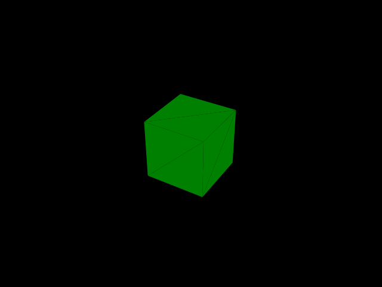

# node-three-screenshot [](https://travis-ci.com/dbkaplun/node-three-screenshot)
Take a PNG screenshot of a THREE scene

## Usage

*[You will need to install the dependencies for node-canvas.](https://github.com/Automattic/node-canvas#compiling)*

```sh
$ npm install node-three-screenshot
```

```js
import { toPNG } from 'node-three-screenshot';

fs.writeFileSync('out.png', toPNG(scene));
```

### With Jest

```sh
$ npm install jest-image-snapshot
```

```js
import { toPNG } from 'node-three-screenshot';
import { toMatchImageSnapshot } from 'jest-image-snapshot';

expect.extend({ toMatchImageSnapshot });

expect(toPNG(obj)).toMatchImageSnapshot();
```

<p align="center">
  
</p>
